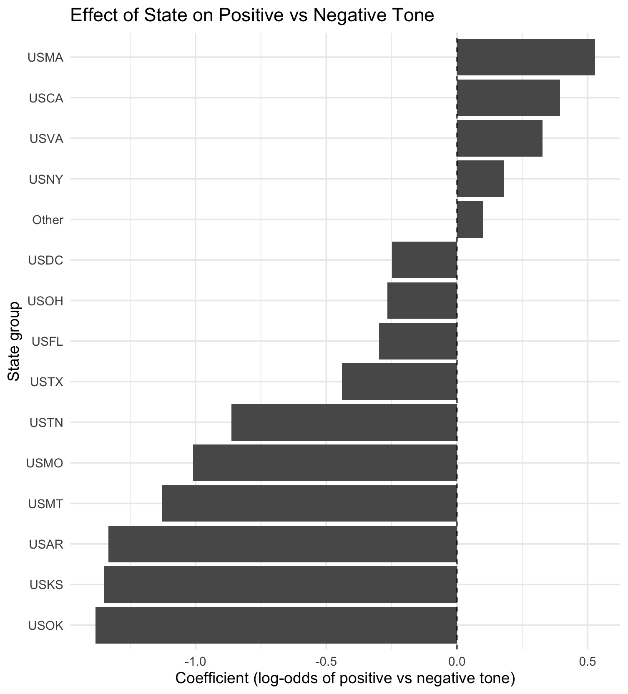
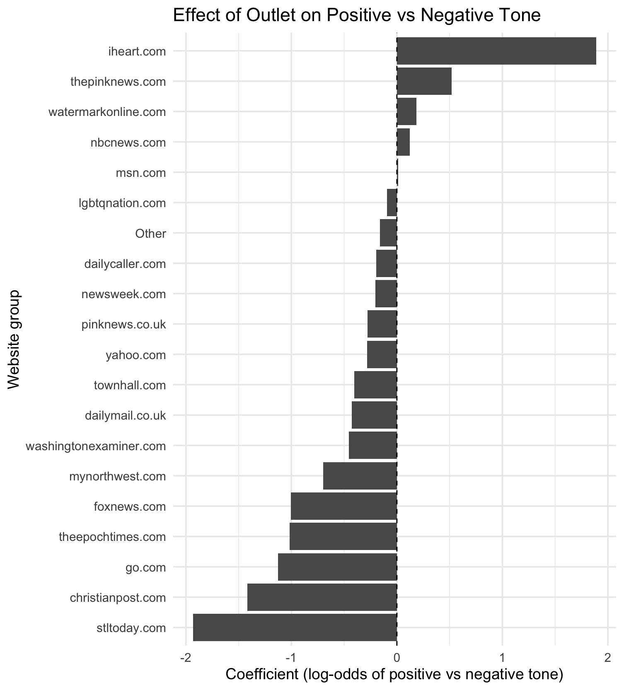

# GitHub Link Stats — Capstone Statistical Testing

This page documents the statistical testing portion of my capstone project: **Who Tells the Transgender Story?**  
Dataset: GDELT transgender-related articles (U.S.-linked, 2021–2025).

---

## 1) Research Question
Do certain GDELT themes appear disproportionately in **negative vs neutral vs positive** coverage?

---

## 2) Variables
- **tone_mean** (numeric): GDELT tone score  
- **tone_label** (categorical): negative / neutral / positive  
- **theme**: GDELT theme tag

Tone labeling rules:
- tone_mean < -1 → negative  
- tone_mean > 1 → positive  
- else → neutral

---

## 3) Chi-Square Test: Theme × Tone
**Why:** Tests whether theme and tone category are independent.


Data not uploaded due to size; code provided for transparency.

### Code
```r
#Create contingency table
theme_tone_table <- table(master_long$theme, master_long$tone_label)

#Run chi-square test
chi_result <- chisq.test(theme_tone_table)
chi_result
Output
- Chi-square statistic:353438
- df: 13108
- p-value: < 2.2e-16

master_long$tone_mean <- as.numeric(master_long$tone_mean)

master_long <- master_long %>%
  mutate(
    tone_label = case_when(
      is.na(tone_mean) ~ "neutral",
      tone_mean < -1   ~ "negative",
      tone_mean >  1   ~ "positive",
      TRUE             ~ "neutral"
    ),
    tone_label = factor(tone_label,
                        levels = c("negative","neutral","positive"))
  )


master_long <- master_long %>%
  mutate(article_id = url)

#Choosing themes from Naive Bayes model

key_themes <- c(
  "TAX_FNCACT",
  "LGBT",
  "BAN",
  "LEGISLATION",
  "WB_615_GENDER",
  "GENERAL_HEALTH",
  "EDUCATION",
  "EPU_POLICY",
  "USPEC_POLITICS_GENERAL1",
  "CRISISLEX_C03_WELLBEING_HEALTH",
  "MEDICAL",
  "TRIAL"
)


#Build article-level dataset (one row per article)
#Each key theme becomes a 0/1 column

article_df <- master_long %>%
  mutate(theme = as.character(theme)) %>%
  filter(theme %in% key_themes) %>%
  mutate(value = 1L) %>%
  select(article_id, tone_label, state, website, theme, value) %>%
  group_by(article_id, tone_label, state, website, theme) %>%
  summarise(value = max(value), .groups = "drop") %>%
  pivot_wider(
    names_from  = theme,
    values_from = value,
    values_fill = list(value = 0L)
  )


#clean tone_label levels
article_df <- article_df %>%
  mutate(
    tone_label = fct_drop(tone_label),
    tone_label = factor(tone_label,
                        levels = c("negative", "neutral", "positive"))
  )


article_sample <- article_df


glimpse(article_df)


multinom_model <- multinom(
  tone_label ~ 
    TAX_FNCACT + LGBT + BAN + LEGISLATION +
    WB_615_GENDER + GENERAL_HEALTH + EDUCATION +
    EPU_POLICY + USPEC_POLITICS_GENERAL1 +
    CRISISLEX_C03_WELLBEING_HEALTH + MEDICAL + TRIAL,
  data  = article_sample,
  trace = FALSE
)


summary(multinom_model)

## table ##
#Pickinh the 12 themes based on Naive Vayes
theme_vars <- c(
  "TAX_FNCACT",
  "LGBT",
  "BAN",
  "LEGISLATION",
  "WB_615_GENDER",
  "GENERAL_HEALTH",
  "EDUCATION",
  "EPU_POLICY",
  "USPEC_POLITICS_GENERAL1",
  "CRISISLEX_C03_WELLBEING_HEALTH",
  "MEDICAL",
  "TRIAL"
)

#Extract coefficients & standard errors from the fitted model
m_sum  <- summary(multinom_model)
coef_m <- m_sum$coefficients
se_m   <- m_sum$standard.errors

#Convert coef matrix to long format
coef_df <- as_tibble(coef_m, rownames = "Outcome") %>%
  pivot_longer(
    cols = -Outcome,
    names_to = "Predictor",
    values_to = "Estimate"
  )

#Convert std error matrix to long format
se_df <- as_tibble(se_m, rownames = "Outcome") %>%
  pivot_longer(
    cols = -Outcome,
    names_to = "Predictor",
    values_to = "StdError"
  )

#Merge and keep 12 themes
theme_effects <- coef_df %>%
  left_join(se_df, by = c("Outcome", "Predictor")) %>%
  filter(Predictor %in% theme_vars) %>%
  mutate(
    z  = Estimate / StdError,
    p  = 2 * (1 - pnorm(abs(z))),
    direction = if_else(
      Estimate > 0,
      "More neutral/positive",
      "More negative"
    )
  )

theme_effects

##plot

library(ggplot2)

theme_plot_df <- theme_effects %>%
  mutate(
    Predictor = fct_reorder(
      Predictor,
      abs(Estimate),
      .fun = max,
      .desc = TRUE
    )
  )

ggplot(theme_plot_df,
       aes(x = Predictor, y = Estimate, fill = Outcome)) +
  geom_col(position = "dodge") +
  coord_flip() +
  geom_hline(yintercept = 0, linetype = "dashed") +
  labs(
    x = "Theme",
    y = "Coefficient (log-odds vs negative tone)",
    title = "Effect of GDELT Themes on Tone (baseline = Negative)",
    fill = "Tone Category"
  ) +
  theme_minimal(base_size = 14)

```


### Code
```r
master_long_2 <- master_long %>%
  mutate(
    tone_mean  = as.numeric(tone_mean),
    tone_label = case_when(
      is.na(tone_mean) ~ "neutral",
      tone_mean < -1   ~ "negative",
      tone_mean >  1   ~ "positive",
      TRUE             ~ "neutral"
    ),
    tone_label = factor(tone_label,
                        levels = c("negative", "neutral", "positive")),
    article_id = url           # use URL as article ID
  )

#Smaller set of key themes (to keep model size reasonable)
key_themes_state <- c(
  "TAX_FNCACT",
  "LGBT",
  "BAN",
  "LEGISLATION",
  "WB_615_GENDER",
  "GENERAL_HEALTH",
  "EDUCATION",
  "EPU_POLICY",
  "USPEC_POLITICS_GENERAL1",
  "CRISISLEX_C03_WELLBEING_HEALTH",
  "MEDICAL",
  "TRIAL"
)

#Build article-level wide dataset: 1 row per article_id
article_state_df_2 <- master_long_2 %>%
  mutate(theme = as.character(theme)) %>%
  filter(theme %in% key_themes_state) %>%
  mutate(value = 1L) %>%
  select(article_id, tone_label, state, website, theme, value) %>%
  group_by(article_id, tone_label, state, website, theme) %>%
  summarise(value = max(value), .groups = "drop") %>%
  pivot_wider(
    names_from  = theme,
    values_from = value,
    values_fill = list(value = 0L)
  )


glimpse(article_state_df_2)

#Group states & websites (top 15–20; rest lump to "Other")
article_state_df_2 <- article_state_df_2 %>%
  mutate(
    state_grp   = fct_lump_n(state, n = 15),    #top 15 states, others -> "Other"
    website_grp = fct_lump_n(website, n = 20)   #top 20 sites, others -> "Other"
  )


set.seed(123)
article_sample_state_2 <- article_state_df_2 %>%
  group_by(tone_label) %>%
  sample_n(size = pmin(10000, n()), replace = FALSE) %>%
  ungroup()

table(article_sample_state_2$tone_label)

state_model <- multinom(
  tone_label ~ 
    TAX_FNCACT + LGBT + BAN + LEGISLATION +
    WB_615_GENDER + GENERAL_HEALTH + EDUCATION +
    state_grp + website_grp,
  data  = article_sample_state_2,
  trace = FALSE
)

summary(state_model)

library(stringr)

m_sum_state  <- summary(state_model)
coef_m_state <- m_sum_state$coefficients
se_m_state   <- m_sum_state$standard.errors

coef_state_df <- as_tibble(coef_m_state, rownames = "Outcome") %>%
  pivot_longer(
    cols = -Outcome,
    names_to = "Predictor",
    values_to = "Estimate"
  )

#keep state_grp predictors
state_effects <- coef_state_df %>%
  filter(str_starts(Predictor, "state_grp")) %>%
  mutate(
    state_code = str_remove(Predictor, "^state_grp"),
    state_code = if_else(state_code == "", "(baseline)", state_code)
  )

#positive vs negative for plotting
state_pos <- state_effects %>%
  filter(Outcome == "positive")

#Bar plot: state effect on positive vs negative tone
ggplot(state_pos,
       aes(x = reorder(state_code, Estimate), y = Estimate)) +
  geom_col() +
  coord_flip() +
  geom_hline(yintercept = 0, linetype = "dashed") +
  labs(
    x = "State group",
    y = "Coefficient (log-odds of positive vs negative tone)",
    title = "Effect of State on Positive vs Negative Tone"
  ) +
  theme_minimal(base_size = 14)

website_effects <- coef_state_df %>%
  filter(str_starts(Predictor, "website_grp")) %>%
  mutate(
    site = str_remove(Predictor, "^website_grp")
  )

website_pos <- website_effects %>%
  filter(Outcome == "positive")

ggplot(website_pos,
       aes(x = reorder(site, Estimate), y = Estimate)) +
  geom_col() +
  coord_flip() +
  geom_hline(yintercept = 0, linetype = "dashed") +
  labs(
    x = "Website group",
    y = "Coefficient (log-odds of positive vs negative tone)",
    title = "Effect of Outlet on Positive vs Negative Tone"
  ) +
  theme_minimal(base_size = 14)
```
 




